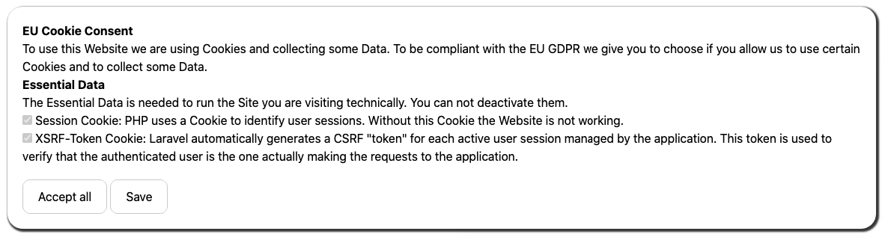

# eu-cookie-consent helps you to stay conform with the EU cookie law

[](https://packagist.org/packages/the42coders/eu-cookie-consent)
[](https://travis-ci.org/42coders/eu-cookie-consent)
[](https://packagist.org/packages/the42coders/eu-cookie-consent)

All sites owned by EU citizens or targeted towards EU citizens must comply with a crazy EU law. This law requires a dialog to be displayed to inform the users of your websites how cookies are being used. You can read more info on the legislation on [the site of the European Commission](http://ec.europa.eu/ipg/basics/legal/cookies/index_en.htm#section_2).

This package provides an easily configurable view to display the message. Also included is JavaScript code to set a cookie when a user agrees with the cookie policy. The package will not display the dialog when that cookie has been set.



## Installation

You can install the package via composer:

```bash
composer require the42coders/eu-cookie-consent
```

Optionally you can publish the following Files

##### Config
This is recommended since you can configure all the consents you want to get from the visitor.
``` bash
php artisan vendor:publish --provider="the42coders\EuCookieConsent\EuCookieConsentServiceProvider" --tag="config" 
```
##### Views
If you want to customize the look and feel of the Package
``` bash
php artisan vendor:publish --provider="the42coders\EuCookieConsent\EuCookieConsentServiceProvider" --tag="views" 
```
##### Language files
This package comes with multilanguage support out of the box. You can translate it to the Languages you want. Or just change the default Text.
``` bash
php artisan vendor:publish --provider="the42coders\EuCookieConsent\EuCookieConsentServiceProvider" --tag="lang" 
```
## Config
This is the heart of the Package you can define all the Cookies/Permissions you want to get form the User.
``` php
return [

    /*
     * Use this setting to enable the cookie consent dialog.
     */
    'enabled' => env('COOKIE_CONSENT_ENABLED', true),

    /*
     * The name of the cookie in which we store if the user
     * has agreed to accept the conditions.
     */
    'cookie_name' => 'laravel_eu_cookie_consent',

    /*
     * Set the cookie duration in minutes.  Default is 365 * 24 * 60 = 1 Year.
     */
    'cookie_lifetime' => 365 * 24 * 60,

    /*
     * Multilanguage support
     *
     * If enabled the title, description, the category keys and the cookie keys are defining the key from the translation files.
     */
    'multilanguage_support' => true,

    /*
     * Save Cookies Route
     */
    'route' => '/saveTheCookie',

    /*
     * Define the style of the Popup
     */
    'popup_style' => '',

    /*
     * Define classes the popup should use.
     */
    'popup_classes' => 'eu-popup',

    /*
     * If you want to have an Accept all Button for the users
     */
    'acceptAllButton' => 'true',

    /*
     * Cookies
     */
    'cookies' => [
        //Defines the translation Key for the saveButton
        'saveButton' => 'Save',
        //Optional: Defines the translation Key for the PopupTitle
        'title' => 'PopupTitle',
        //Optional: Defines the translation Key for the PopupDescription
        'description' => 'PopupDescription',
        //To make the popup easier to consume for the user you can organize your Cookies in categories.
        'categories' => [
            //The key defines the translation key in the translations for this category.
            'essential' => [
                //Optional: The description defines the key in the translations for the category description
                'description' => 'essential_description',
                //In this array you can define all the Cookies you want to request form the User
                'cookies' => [
                    //The key defines the key in the translations and is used to access the Cookie specific information
                    'session' => [
                        //Optional: you can set forced to make it impossible for the user to not accept this cookie.
                        'forced' => 'true',
                        //Optional: The description defines the key in the translations
                        //'description' => 'key in translation File'
                    ],
                    'xsrf-token' => [
                        'forced' => 'true',
                    ],
                ],
            ],
        ],
    ],

];
```

## Usage

##### Popup
To enable the Popup you can use the following Code in your blade Files (it returns html code).
``` php
{!! EuCookieConsent::getPopup() !!}
```

If you want to give the users the option to change the permissions just add another line
``` php
{!! EuCookieConsent::getUpdatePopup() !!}
```
This gives you the possibility to call the dialog with the given user settings by javascript.

Just call the following js function and the popup will appear.
``` js
update_popup()
```

##### Permission
If you want to check if the user gave you a specific permission. You can just pass the key of the Cookie you defined in the config file.
``` php
EuCookieConsent::canIUse('key from the cookies config')
```
##### Scripts/Imports ...
Very often we want to play out a specific Script Tag ... only if the user allowed us. You can define
the Scripts in the config of the cookie. If you use the key header for example you can render them from all of the cookies.
``` php
{!! EuCookieConsent::getHtml('header') !!}
```

### Testing

``` bash
composer test
```

### Changelog

Please see [CHANGELOG](CHANGELOG.md) for more information what has changed recently.

## Contributing

Please see [CONTRIBUTING](CONTRIBUTING.md) for details.

### Security

If you discover any security related issues, please email max@42coders.com instead of using the issue tracker.

## Credits

- [Max Hutschenreiter](https://github.com/42coders)
- [All Contributors](../../contributors)

## License

The MIT License (MIT). Please see [License File](LICENSE.md) for more information.

## Laravel Package Boilerplate

This package was generated using the [Laravel Package Boilerplate](https://laravelpackageboilerplate.com).
